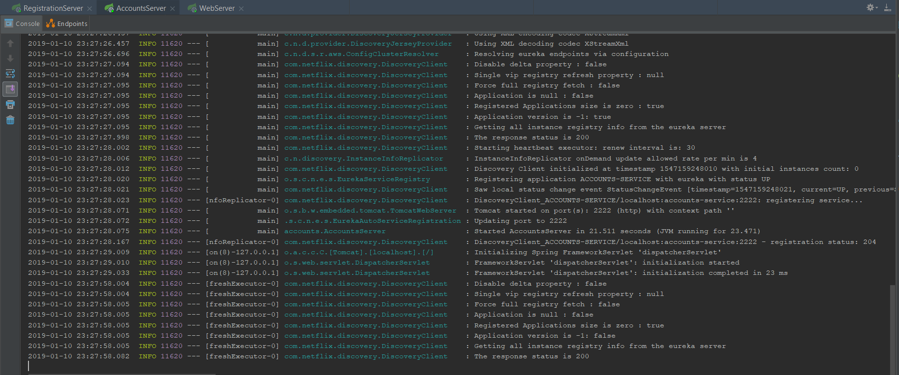
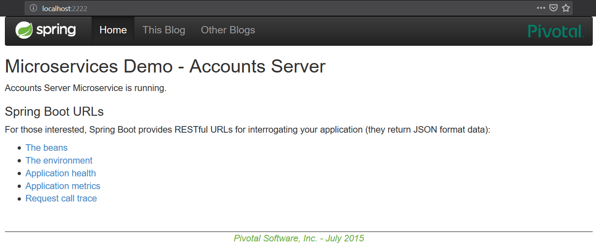
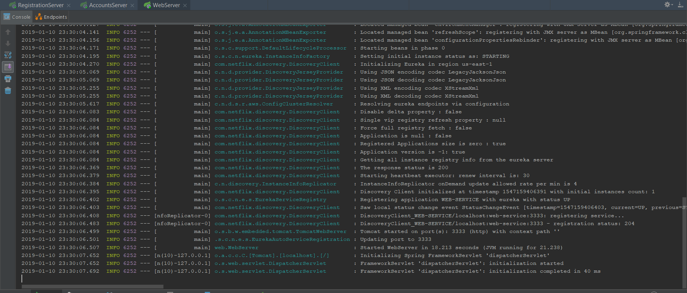
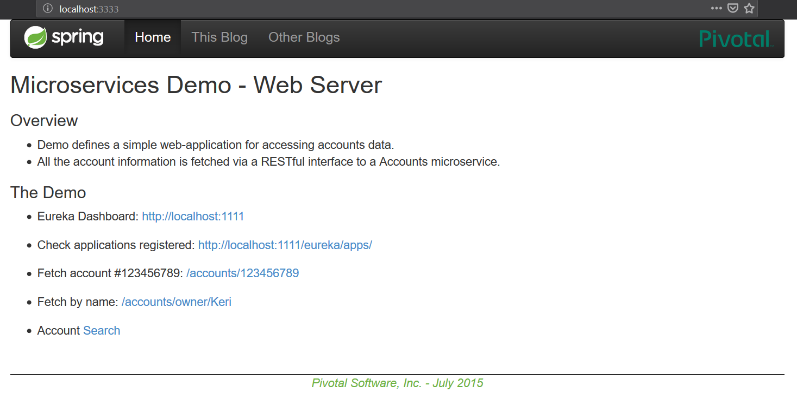
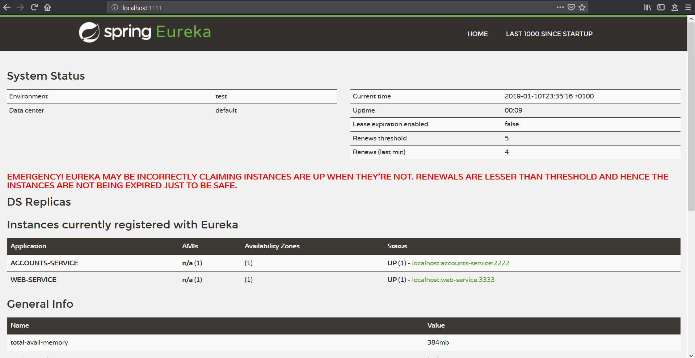
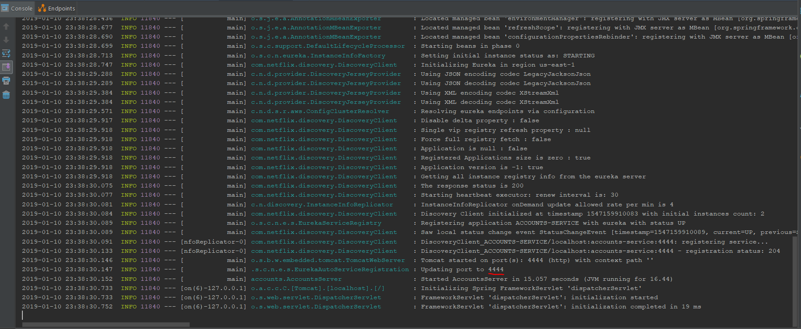
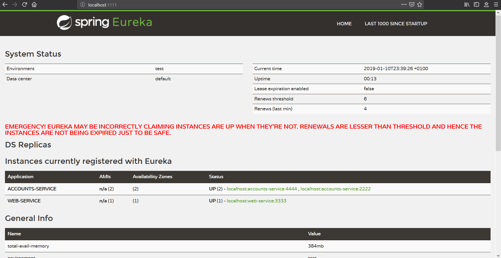
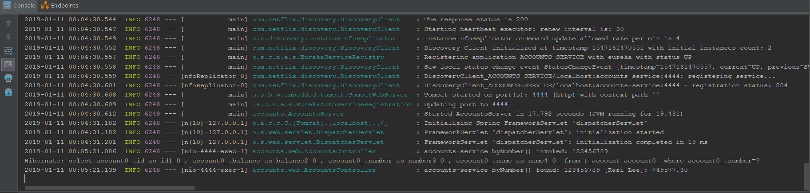

#### 1: The two microservices are running and registered

* Account microservice running:

* Web microservice running:

#### 2: The service registration service has the two microservices registered
* Registration microservice GUI with 2 microservices registered:

#### 3: A second account microservice is running on port 4444 and it is registered
* Account microservice running on port 4444:

* New account microservice registered:

#### 4: What happens when you kill the microservice with port 2222?. Can the web service provide information about the accounts? Why?

When the first account microservice is killed, the web service is still able to provide information about the accounts 
because it makes use of the new account microservice running on port 4444.

The image below shows a log of the new account microservice mentioned, being the last few lines related to the request sent 
by the web microservice.

